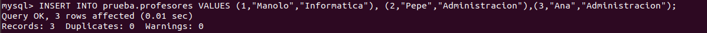
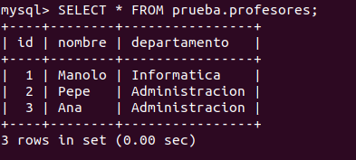
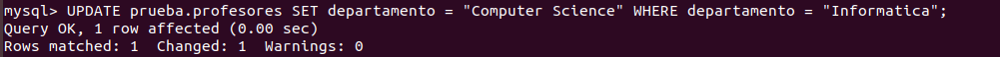
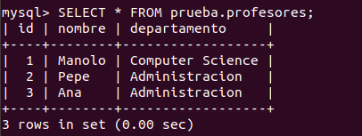
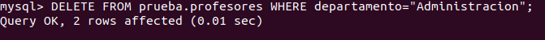
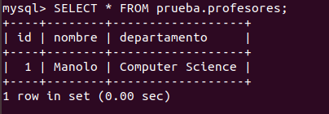
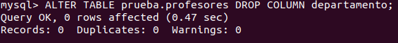
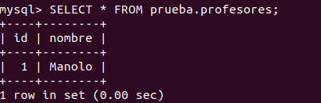
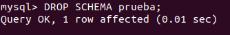
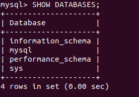

# INSTALACION DE MYSQL EN UBUNTU

## Instalacion
En primer lugar, utilizaremos el comando `sudo apt-get update`, que actualizará la lista de paquetes. Tendremos que escribir nuestra contraseña para continuar.

Una vez hecho, con el comando `sudo apt-get install mysql-server`
instalaremos mysql server (nos pedirá la contraseña otra vez).

Una vez esté instalado, con `sudo mysql` arrancaremos la shell de mysql server.

## Probando mysql server 
Ahora podremos hacer unas pruebas:
- Creamos una base de datos *prueba*:

- Creamos una tabla *profesores*, con los atributos *id*, *nombre* y *departamento*:

- Insertamos unos valores en la tabla:

- Hacemos una consulta simple para ver que realizamos los pasos anteriores correctamente:

- Modificamos las tuplas en las que el *departamento* sea Informática:

- Comprobamos que se hizo correctamente:

- Borramos las tuplas en las que el *departamento* sea Administración:

- Comprobamos que se hizo correctamente:

- Borramos la columna de los *departamentos*:

- Comprobamos que se hizo correctamente:

- Ya hemos hecho unas cuantas pruebas. Borramos la base de datos:

- Vemos que se ha borrado correctamente:

