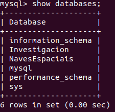
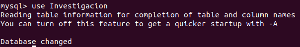
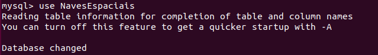
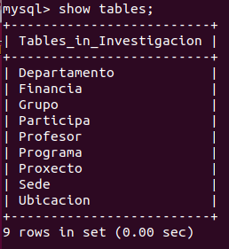
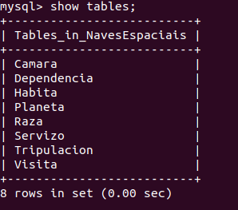
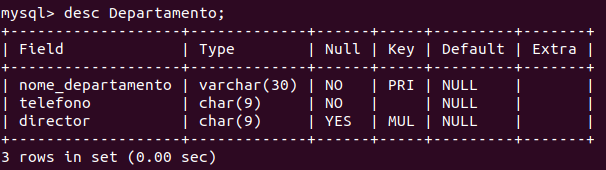
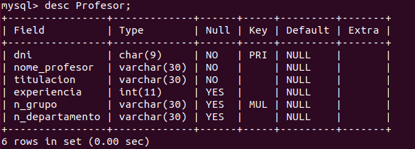
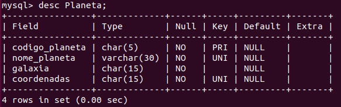
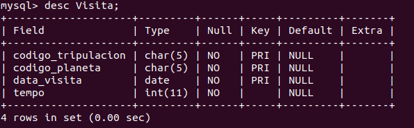

## Comandos de la shell de mysql para visualizar nuestras bases de datos

- Con el comando `show databases` podemos ver todas nuestras bases de datos:

  

- Con el comando `use nombre_base_datos` podemos seleccionar la base de datos que queremos usar:

  
  
   
  
- Con el comando `show tables` podremos ver todas las tablas de la base de datos en la que estemos trabajando:

  
  
  
  
- Para ver con más detalle cada una de las tablas, podemos utilizar `desc nombre_tabla`

   
   
   
   
   
   
   

De esta forma podremos ir comprobando la estructura que hemos creado en los scripts.
